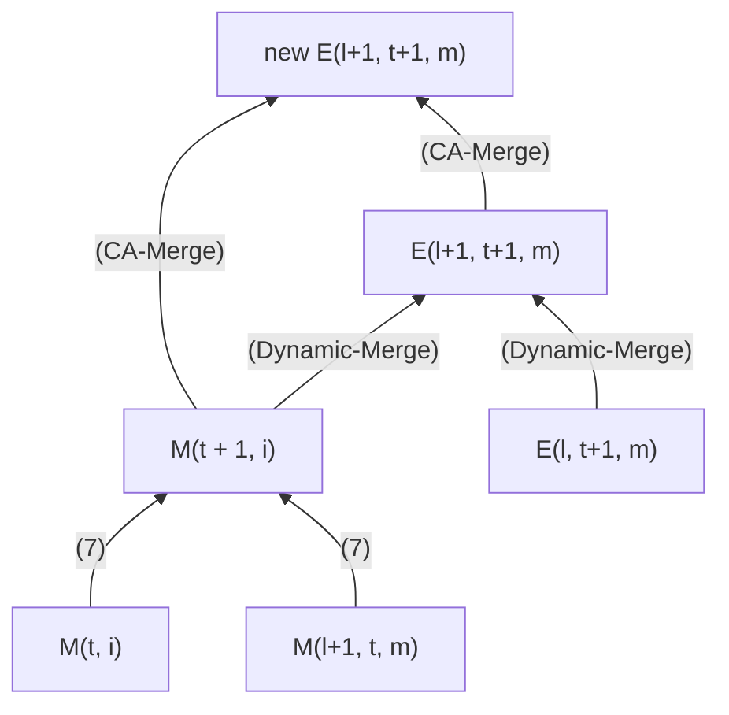

### Takeaways
- Presents a method to merge the parameters of multiple experts into one
- How much the parameters of each expert contributed to the merged parameters is influenced by the curvature of the loss function with respect to the experts' parameters
- An intuition behind using curvature for searching in parameters manifold (without involving Riemannian geometry): when following the slope (gradient), if we know that the slope will not change for a while (flat curvature) then we can take big steps; otherwise if the slope is changing (sharp curve) then a smaller step can result in a big difference
- for more insight, see [[Riemannian Manifolds and Fisher Information]]
- For layer `l + 1` and time step `t + 1`, the merged parameters is calculated using:
- parameters at layer `l` and time step `t + 1`
- parameters at layer `l + 1` and time step `t`
- curvature matrices of every expert at time step `t` and `t + 1`
- Graph of how the merged parameters for layer `l + 1` and time step `t + 1` is computed
  
  Notation: `E(layer, time step, expert)`, `M(layer, expert)`

- It appears that the method performs a static merge (fuse the experts into one before inference) rather than dynamic merge (the experts are combined on-the-fly during inference), but it's unclear what data was used for the merging procedure.
- there might be a major error in equation (6) that could render some claims invalid
- the improvements are significant and consistent

### Ideas
- How to amplify the effect from some experts ?